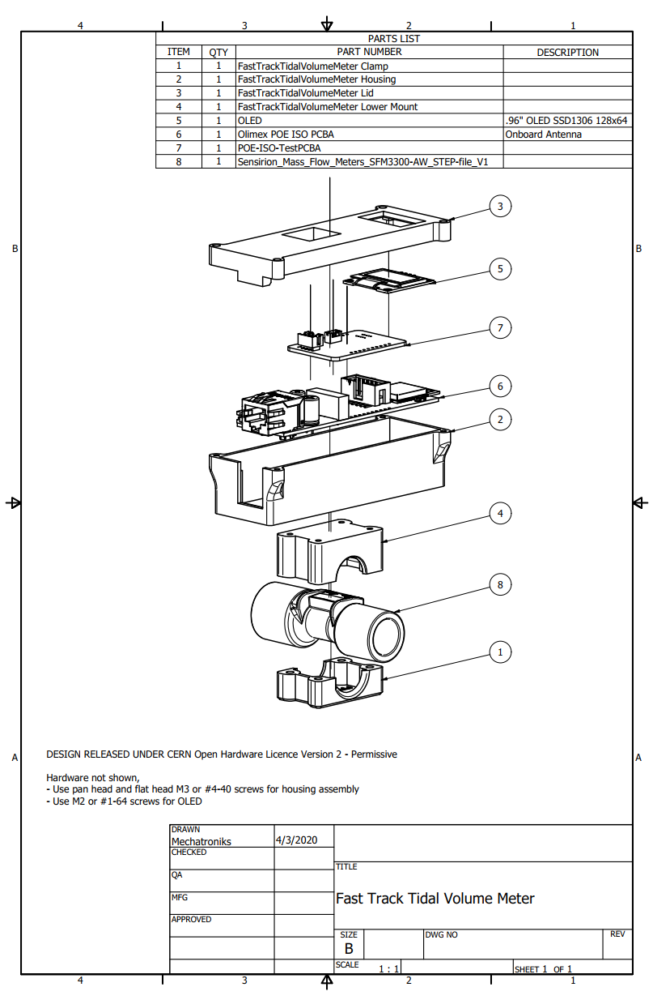

# Fast Track Tidal Volume Meter

Open Source device to measure tidal volume

## Background

Standalone tidal flow meters do not exist. The goal of this device is to allow anyone to have independent monitoring of tidal volume. 

### Making Device

Currently the device is made using the following

* Olimex ESP32-POE-ISO
* SSD1306 .96" OLED
* Sensirion SFM3300 flow sensor
* PCBA (in development)

## Notes

FDA HAS NOT AUTHORIZED USE OF THIS DEVICE, DESIGNS, SOURCE CODE OR DESCRIPTIONS.

## Licence

CERN Open Hardware Licence Version 2 - Permissive See licence file for more info.

